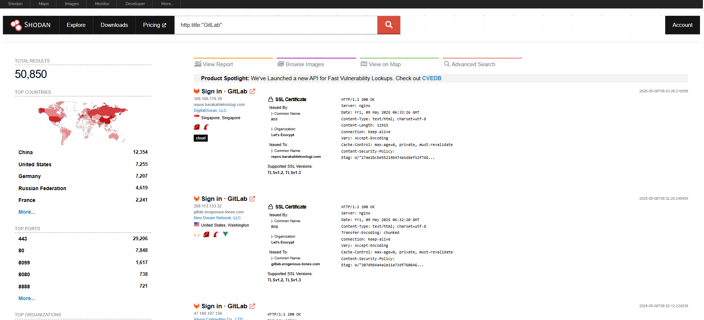

# Gitlab XSS & CSP Bypass on Commit Page - ATO - POC Code

0-day as of Saturday, May 10, 2025. Version - 17.11.2 - 90+ days since report at February 4, 2025. I guess it's a 3 month old duplicate. Severity is somewhere between 8.0 and 9.0.

## Video POC - XSS

[](https://youtu.be/xEB7v0Ye7pE)

## Video POC - ATO

[](https://youtu.be/rzFndaPhj2k)

## Quick Start

1. Clone the repository:

```
git clone https://github.com/justas-b1/gitlab-xss.git
cd gitlab-xss
```

2.1 Modify the xss.txt or ato.txt file.

2.2 Run - XSS

```
python poc.py --url "https://gitlab.com/group/project/-/commit/49d1bf57b239f06b87d317868anmnc3447e59581" --session "YOUR_SESSION_COOKIE_VALUE" --file xss.txt
```

2.3 Run - ATO
```
python poc.py --url "https://gitlab.com/group/project/-/commit/49d1bf57b239f06b87d317868anmnc3447e59581" --session "YOUR_SESSION_COOKIE_VALUE" --file ato.txt
```

## Explanation - XSS

json:table allows HTML injection using "isHtmlSafe": true attribute. This combined with data-blob-diff-path leads to XSS and CSP bypass on commit page.

The data-blob-diff-path="partial_url" takes the raw HTML contents of https://gitlab.com/partial_url response and appends it on page.

## Explanation - Arbitrary POST Request - ATO

Victim clicks on invisible, full page overlay -> payload sends a POST request that adds secondary email (which is attacker controlled) -> attacker can then go to that secondary email, follow the confirmation link -> then use confirmed secondary email to change password and remove primary email (locking victim out of their account).

## Steps to reproduce - XSS

1. Create a project.
2. Create a HTML file with XSS payload <script>alert(document.domain)</script>
3. Copy the HTML files partial raw path, example: /group/project/-/raw/main/test.html and modify xss.txt payload.
4. Create any merge request and go to commit page (a page where file diffs are located).
5. Add a comment with modified xss.txt payload
6. The auto refresh should render payload for both attacker and victim.
7. If victim clicks on invisible, full page overlay, payload triggers.

## Steps to reproduce - Arbitrary POST Request - ATO, New Admin Account, SSH Key

1. Just post a comment with any of these payloads
2. Admin.txt payload only works if victim has admin privileges, not likely, but potentially devastating since it automatically creates new verified admin account, which can then delete other admins.
3. ssh.txt payload adds new ssh key to victims account.

Or just run the script.

## 🛠️ GitLab Commit Note Poster (Automated Script)

This script allows you to post notes to GitLab commit pages using the GitLab web interface (not the API) by simulating browser behavior with curl. It supports:

- Session authentication via _gitlab_session cookie
- Automatic CSRF token extraction
- Periodic, repeated note posting
- Reading note content from a local text file

## ⚙️ What the Script Does

| Step                          | Description                                                                          |
| ----------------------------- | ------------------------------------------------------------------------------------ |
| 🔗 **URL Parsing**            | Takes a full GitLab commit URL and extracts domain, namespace, and commit ID.        |
| 🔐 **Authentication**         | Uses the provided `_gitlab_session` cookie to authenticate like a logged-in browser. |
| 🛡️ **CSRF Token Extraction** | Sends a GET request to the commit page and extracts the `<meta name="csrf-token">`.  |
| 📤 **Note Posting**           | Sends a `POST` request to submit a note on the commit using the token and session.   |
| ♻️ **Looping**                | Continuously re-posts the note at a user-defined interval (default 60s).             |

## 📦 Script Arguments

| Argument     | Required                   | Description                                                                  |
| ------------ | -------------------------- | ---------------------------------------------------------------------------- |
| `--url`      | ✅ Yes                      | Full GitLab commit URL (e.g. `https://gitlab.com/group/repo/-/commit/<SHA>`) |
| `--session`  | ✅ Yes                      | Value of your `_gitlab_session` cookie from browser                          |
| `--file`     | ❌ No (default: `text.txt`) | Path to a local file containing the note body (multiline supported)          |
| `--interval` | ❌ No (default: `60`)       | Interval in seconds to re-post the note repeatedly                           |

## 🧪 Example Usage

```
python gitlab_note.py \
  --url https://gitlab.com/group/project/-/commit/<SHA> \
  --session YOUR_SESSION_COOKIE_VALUE \
  --file xss.txt \
  --interval 30
```

## 💡 Company Information

GitLab is a web-based DevOps platform that provides an integrated CI/CD pipeline, enabling developers to plan, develop, test, and deploy code seamlessly. Key features include:

- Version Control (Git)
- Issue Tracking 🐛
- Code Review 🔍
- CI/CD Automation 🚀

## 🏢 Who Uses GitLab?

GitLab is trusted by companies of all sizes, from startups to enterprises, including:

| Company       | Industry              |
| ------------- | --------------------- |
| Goldman Sachs | Finance 💵            |
| Siemens       | Engineering ⚙️        |
| NVIDIA        | Technology 💻         |
| T-Mobile      | Telecommunications 📱 |
| NASA          | Aerospace 🚀          |

## 🛡️ GitLab in Defense

GitLab is favored by U.S. Department of Defense (DoD) agencies for secure, self-hosted DevSecOps environments, offering:

- On-Premise Deployment 🖥️
- Security & Compliance 🔒

Its ability to manage sensitive data and maintain operational control makes GitLab a key tool for government and defense sectors.

## Affected Websites

Shodan query: http.title:"GitLab"

Returns more than 50 thousand results.



## ⚠️ Legal Disclaimer  

This Proof-of-Concept (PoC) is provided **for educational purposes only**.  

- **Authorized Use Only**: Test only on systems you own or have explicit permission to assess.  
- **No Liability**: The author is not responsible for misuse or damages caused by this tool.  
- **Ethical Responsibility**: Do not use this tool to violate laws or exploit systems without consent.  

By using this software, you agree to these terms.
